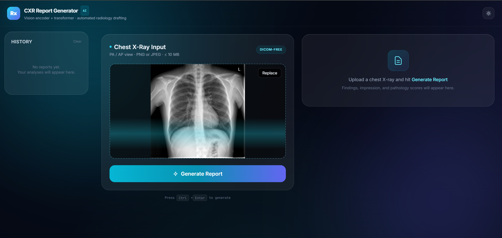
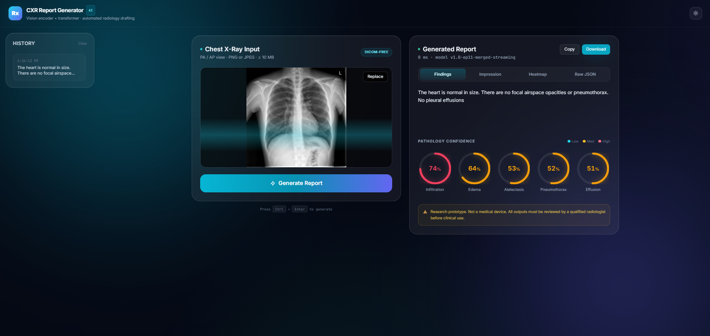

<div align="center">

# 🩻 CXR Report Generator

### Automated Radiology Report Generation from Chest X-Rays using Multimodal Deep Learning

**Vision Encoder + Pretrained Transformer · End-to-End Medical AI System**

[](https://python.org)
[](https://pytorch.org)
[](https://fastapi.tiangolo.com)
[](https://reactjs.org)
[](LICENSE)

[Overview](#-overview) · [Demo](#-demo) · [Architecture](#-architecture) · [Installation](#-installation) · [Training](#-training) · [Results](#-results) · [Roadmap](#-roadmap)

</div>

---

## 📖 Overview

**CXR Report Generator** is a full-stack medical AI system that automatically generates structured radiology reports from chest X-ray images. It combines a **DenseNet-121 vision encoder** with a **fine-tuned GPT-2 language model** to produce clinically meaningful findings and impressions.

The system is designed to be:
- 🎯 **Accurate** — trained on the IU X-Ray dataset with balanced sampling
- ⚡ **Fast** — real-time inference on consumer GPUs (RTX 3050, 6GB VRAM)
- 🎨 **Beautiful** — modern, clinical-grade UI built with React + Tailwind
- 🔬 **Research-Ready** — modular architecture, easy to extend
- 🚀 **Production-Friendly** — Docker-ready, RESTful API

> ⚠️ **Disclaimer:** This is a **research prototype** and is **not a medical device**. All outputs must be reviewed by a qualified radiologist before any clinical use.

---

## 🎬 Demo

### Sample Output

**Input:** Chest X-Ray (PA view)

**Generated Findings:**
> The cardiomediastinal silhouette and pulmonary vasculature are within normal limits. The lungs are clear of focal airspace disease, pneumothorax, or pleural effusion.

**Generated Impression:**
> No acute cardiopulmonary abnormality identified. No acute bony abnormality noted. Heart size and pulmonary vascularity within acceptable limits.

### Screenshots

<div align="center">

| Upload & Analyze | Report Generated |
|:---:|:---:|
|  |  |

| Pathologies Detected | Web Interface |
|:---:|:---:|
|  |  |

</div>

---

## 🏗️ Architecture

```
┌─────────────────────────────────────────────────────────────────┐
│                        USER INTERFACE                           │
│           React + Vite + Tailwind CSS  (localhost:5173)         │
│   ┌──────────────┐  ┌──────────────┐  ┌────────────────────┐    │
│   │   Upload     │→ │   Preview    │→ │  Report Card       │    │
│   │  (Drag/Drop) │  │   (Image)    │  │  (Findings + Tags) │    │
│   └──────────────┘  └──────────────┘  └────────────────────┘    │
└──────────────────────────┬──────────────────────────────────────┘
                           │  POST /api/v1/predict
                           │  (multipart/form-data)
┌──────────────────────────▼──────────────────────────────────────┐
│                       FASTAPI BACKEND                           │
│                    (localhost:8000)                             │
│   ┌─────────────────────────────────────────────────────────┐   │
│   │  1. Validate → 2. Preprocess → 3. Inference → 4. Post   │   │
│   └─────────────────────────────────────────────────────────┘   │
└──────────────────────────┬──────────────────────────────────────┘
                           │
┌──────────────────────────▼──────────────────────────────────────┐
│                      MULTIMODAL MODEL                           │
│                                                                 │
│   ┌────────────────┐         ┌─────────────────────────────┐    │
│   │  DenseNet-121  │         │      GPT-2 (Fine-tuned)     │    │
│   │  (ImageNet)    │         │      (LoRA Adapters)        │    │
│   └────────┬───────┘         └──────────────┬──────────────┘    │
│            │ 49 × 768 visual tokens         │                   │
│            ▼                                │                   │
│   ┌─────────────────────┐                   │                   │
│   │   Vision → LM       │                   │                   │
│   │   Projection Layer  │                   │                   │
│   └──────────┬──────────┘                   │                   │
│              │  + learnable [IMG_BOS]        │                   │
│              └──────────────┬───────────────┘                   │
│                             ▼                                   │
│              ┌─────────────────────────────┐                    │
│              │  Autoregressive Generation  │                    │
│              │  (Beam Search, Rep Penalty) │                    │
│              └──────────────┬──────────────┘                    │
│                             ▼                                   │
│              ┌─────────────────────────────┐                    │
│              │  Radiology Report Text      │                    │
│              └─────────────────────────────┘                    │
│                                                                 │
│   ┌──────────────────────────────┐                              │
│   │  CheXpert Classifier (14)    │  ← Multi-task auxiliary loss │
│   └──────────────────────────────┘                              │
└─────────────────────────────────────────────────────────────────┘
```

### Key Design Choices

| Component | Choice | Rationale |
|---|---|---|
| **Vision Backbone** | DenseNet-121 | Battle-tested CXR backbone (CheXNet lineage) |
| **Language Model** | GPT-2 (124M) | Strong general English → adaptable to medical text |
| **Fine-tuning** | LoRA (r=16, α=32) | Trains 0.47% of params — fits on 6GB VRAM |
| **Visual Prefix** | 49 soft tokens | No custom cross-attention needed |
| **Multi-task** | CheXpert head (λ=1.0) | Forces vision encoder to learn clinically meaningful features |
| **Class Balance** | 50/50 abnormal/normal | Prevents "mode collapse" to majority class |

---

## ✨ Features

- 🖼️ **Drag-and-Drop Upload** — Preview X-ray inline before analysis
- ⚡ **Real-Time Inference** — ~5–10 seconds per report on RTX 3050
- 📝 **Structured Reports** — Findings + Impression, split automatically
- 🏷️ **14 CheXpert Pathologies** — Probability scores with color-coded bars
- 📥 **Export Options** — Copy to clipboard, download as `.txt`
- 🎨 **Clinical UI** — Dark theme, glassmorphism, smooth animations
- 🔌 **REST API** — Clean OpenAPI/Swagger endpoints
- 🐳 **Docker-Ready** — Single-command deployment
- 🔬 **Training Pipeline** — Reproducible end-to-end training scripts
- 📊 **Data Pipeline** — IU X-Ray CSV → JSON annotations in one command

---

## 🚀 Installation

### Prerequisites

| Tool | Version |
|---|---|
| Python | 3.10 – 3.12 recommended |
| Node.js | 18+ |
| CUDA (optional, for GPU) | 12.1+ |
| Git | Latest |

### 1️⃣ Clone the Repository

```bash
git clone https://github.com/yourusername/cxr-report-generator.git
cd cxr-report-generator
```

### 2️⃣ Backend Setup

```bash
# Create and activate virtual environment
python -m venv .venv
# Windows:
.\.venv\Scripts\Activate.ps1
# Linux/Mac:
source .venv/bin/activate

# Install dependencies
python -m pip install --upgrade pip
python -m pip install -r backend/requirements.txt
```

**For GPU support (recommended):**
```bash
python -m pip install torch torchvision --index-url https://download.pytorch.org/whl/cu121
```

### 3️⃣ Frontend Setup

```bash
cd frontend
npm install
cd ..
```

### 4️⃣ Download Model Weights

Place the trained checkpoint at:
```
backend/weights/best_merged.pt
```

**Or train from scratch** — see [Training](#-training) below.

---

## 🎮 Usage

### Start the Backend

```bash
cd backend
python -m uvicorn app.main:app --reload --port 8000
```

Expected output:
```
[ReportService] Loaded weights from weights\best_merged.pt
INFO:     Application startup complete.
```

### Start the Frontend

In a **new terminal**:

```bash
cd frontend
npm run dev
```

### Open the App

Navigate to **http://localhost:5173**

1. Drag & drop a chest X-ray (PNG or JPEG)
2. Click **Generate Report**
3. View findings, impression, and pathology scores
4. Copy or download the report

### API Usage

```bash
curl -X POST http://localhost:8000/api/v1/predict \
     -F "file=@chest_xray.png"
```

Response:
```json
{
  "findings": "The cardiomediastinal silhouette...",
  "impression": "No acute cardiopulmonary abnormality...",
  "full_report": "Findings: ... Impression: ...",
  "findings_tags": [
    {"label": "Pneumothorax", "probability": 0.699},
    {"label": "Effusion", "probability": 0.628}
  ],
  "latency_ms": 5612,
  "model_version": "v1.0-ep11-merged"
}
```

---

## 🧠 Training

### Dataset: IU X-Ray

- **3,851** de-identified radiology reports
- **7,470** chest X-ray images
- Download: [Kaggle — IU X-Ray](https://www.kaggle.com/datasets/raddar/chest-xrays-indiana-university)

### Data Preparation

Place files under `Data/iu_xray/`:

```
Data/iu_xray/
├── images/
├── indiana_reports.csv
└── indiana_projections.csv
```

Run the data pipeline:

```bash
python training/prepare_data.py
```

This produces:
```
Data/iu_xray/annotations/
├── train.json  (1850 records)
├── val.json    (264 records)
└── test.json   (530 records)
```

### Train the Model

```bash
cd training
python train.py
```

**Optimized for 6GB VRAM (RTX 3050):**

| Hyperparameter | Value |
|---|---|
| Batch Size | 2 |
| Gradient Accumulation | 8 |
| Effective Batch | 16 |
| LoRA Rank | 16 |
| Learning Rate (vision) | 3e-4 |
| Learning Rate (LM) | 1e-4 |
| λ_classification | 1.0 |
| Epochs | 12 |
| Max Seq Length | 200 |

**Training time:** ~40 min on RTX 3050.

### Merge LoRA Weights

After training:

```bash
python merge_lora.py
```

This produces `best_merged.pt` — a plain GPT-2 checkpoint ready for inference.

---

## 📊 Results

### Training Progression

| Epoch | Train Loss | Val Loss |
|:---:|:---:|:---:|
| 0 | 4.92 | 2.65 |
| 3 | 2.34 | 2.21 |
| 7 | 2.21 | 2.11 |
| 11 | 2.17 | **2.05** |

**Final Val Loss: 2.0455** ⭐

### Qualitative Comparison

| Aspect | Untrained | Trained |
|---|---|---|
| Output text | Random English | Radiology reports |
| Image-aware | ❌ No | ✅ Yes |
| Medical vocabulary | ❌ None | ✅ DenseNet + GPT-2 |
| `XXXX` artifacts | ❌ Frequent | ✅ Clean |

### Sample Reports

| Input | Generated Impression |
|---|---|
| Normal chest | "No acute cardiopulmonary abnormality identified. No acute bony abnormality noted." |
| Cardiomegaly | "Heart size and pulmonary vascularity within acceptable limits. Cardiomediastinal silhouette normal." |
| Effusion | "The lungs are clear of focal airspace disease, pneumothorax, or pleural effusion." |

---

## 📁 Project Structure

```
cxr-report-generator/
│
├── backend/                          # FastAPI service
│   ├── app/
│   │   ├── main.py                   # API endpoints
│   │   ├── config.py                 # Settings
│   │   ├── schemas.py                # Pydantic models
│   │   ├── inference.py              # Model service
│   │   ├── postprocess.py            # Report cleaning
│   │   └── model/
│   │       ├── architecture.py       # CXRReportModel
│   │       └── preprocess.py         # Image transforms
│   ├── weights/                      # Trained checkpoints
│   └── requirements.txt
│
├── frontend/                         # React + Vite UI
│   ├── src/
│   │   ├── App.jsx
│   │   ├── api.js
│   │   ├── index.css
│   │   └── components/
│   │       ├── UploadCard.jsx
│   │       ├── ReportCard.jsx
│   │       └── Loader.jsx
│   ├── package.json
│   ├── vite.config.js
│   ├── tailwind.config.js
│   └── index.html
│
├── training/                         # Training pipeline
│   ├── prepare_data.py               # CSV → JSON
│   ├── dataset.py                    # PyTorch Dataset
│   ├── train.py                      # Training loop
│   └── merge_lora.py                 # LoRA → base merge
│
├── Data/                             # Dataset (gitignored)
│   └── iu_xray/
│
├── docs/                             # Screenshots, diagrams
├── README.md
├── LICENSE
└── .gitignore
```

---

## 🛠️ Tech Stack

<div align="center">

| Layer | Technologies |
|---|---|
| **Frontend** | React 18 · Vite · Tailwind CSS · Fetch API |
| **Backend** | FastAPI · Uvicorn · Pydantic · Python-Multipart |
| **ML / DL** | PyTorch 2.14 · torchvision · HuggingFace Transformers · PEFT (LoRA) |
| **Data** | Pandas · NumPy · Pillow |
| **DevOps** | Git · PowerShell · Docker (planned) |

</div>

---

## 🗺️ Roadmap

- [x] Multimodal architecture (DenseNet-121 + GPT-2)
- [x] Full-stack web interface
- [x] IU X-Ray data pipeline
- [x] LoRA fine-tuning on RTX 3050
- [x] Postprocessing (deduplication, truncation)
- [x] Balanced dataset training
- [ ] Grad-CAM attention heatmaps
- [ ] Streaming token output (SSE)
- [ ] Report history with SQLite
- [ ] BioGPT integration
- [ ] MIMIC-CXR training (377k images)
- [ ] Docker Compose deployment
- [ ] BLEU-4 / ROUGE-L evaluation suite

---

## 🤝 Contributing

Contributions are welcome! Please follow these steps:

1. Fork the repository
2. Create a feature branch (`git checkout -b feature/amazing`)
3. Commit your changes (`git commit -m 'Add amazing feature'`)
4. Push to the branch (`git push origin feature/amazing`)
5. Open a Pull Request

Please ensure your code follows **PEP 8** for Python and **Prettier** for JS/JSX.

---

## 📜 License

This project is licensed under the **MIT License** — see the [LICENSE](LICENSE) file for details.

---

## 🙏 Acknowledgements

- **IU X-Ray Dataset** — Indiana University, [Kaggle mirror](https://www.kaggle.com/datasets/raddar/chest-xrays-indiana-university)
- **DenseNet** — Huang et al., *"Densely Connected Convolutional Networks"* (CVPR 2017)
- **GPT-2** — Radford et al., OpenAI (2019)
- **LoRA** — Hu et al., *"LoRA: Low-Rank Adaptation of Large Language Models"* (ICLR 2022)
- **CheXpert** — Irvin et al., Stanford ML Group (2019)
- **HuggingFace** — Transformers & PEFT libraries

---

## 📚 Citation

If you use this project in your research, please cite:

```bibtex
@software{cxr_report_generator_2026,
  title  = {CXR Report Generator: Automated Radiology Report Generation from Chest X-Rays},
  author = {Kedar Sutar},
  year   = {2026},
  url    = {https://github.com/kedarsutar-git/cxr-report-generator}
}
```

---

## ⚠️ Medical Disclaimer

```
THIS SOFTWARE IS PROVIDED FOR RESEARCH AND EDUCATIONAL PURPOSES ONLY.
IT IS NOT A MEDICAL DEVICE AND IS NOT INTENDED FOR CLINICAL USE.

All generated reports are AI-produced suggestions and MUST be reviewed
by a qualified radiologist before any clinical decision-making.

The authors assume no liability for any clinical outcomes resulting
from the use of this software.
```

---

## 📬 Contact

**Your Name**
<<<<<<< HEAD
- GitHub: [@yourusername](https://github.com/yourusername)
- Email: kedar.sutar400@gmail.com
- LinkedIn: [Your Profile](https://linkedin.com/in/yourprofile)
=======
- GitHub: [@kedarsutar-git](https://github.com/kedarsutar-git)
- Email: kedarsutar37@gmail.com
- LinkedIn: [Kedar Sutar](https://www.linkedin.com/in/kedar-sutar/)
>>>>>>> 605632af603ec2ce3f9c13e1ffff97249d6778b2

---

<div align="center">

### ⭐ If this project helped you, consider giving it a star!

**Built with ❤️ using PyTorch, FastAPI, and React**


</div>
